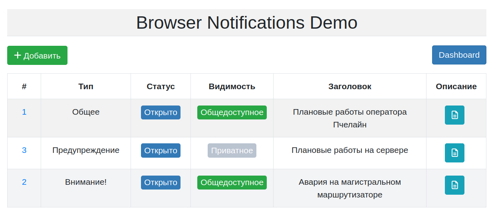
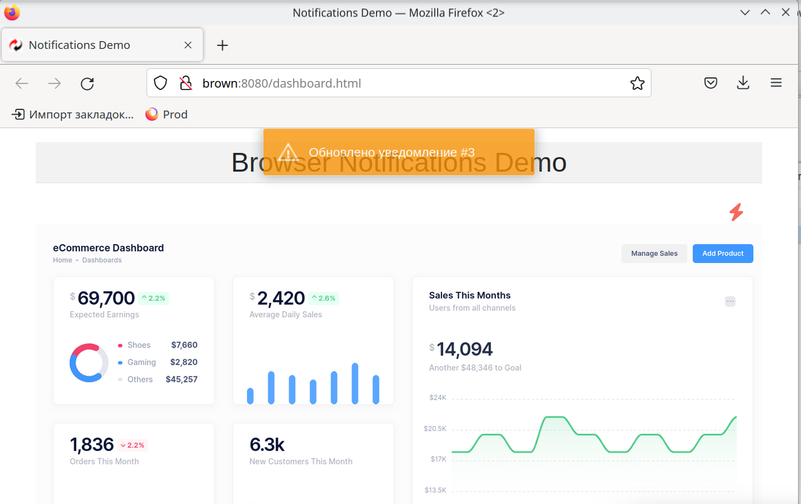

# Brown - application for real time browser notifications 

**Brown** provides means for management and delivery of notifications  about various events/incidents in real time via special informer with popups in browser window.

It is divided into two parts. The first one is a module for notification management. You can create, update and close notifications.
The second one is a notification informer to be used on client's browser side to display notifications in real time.

### Technologies
#### Backend:
1. Ktor
2. WebSocket
3. Postgres
4. Exposed

#### FrontEnd:
   1. React
   2. TypeScript

## Visualization demo

## Documentation

1. Marketing
    1. [Stakeholders](./docs/01-marketing/02-stakeholders.md)
    2. [Target audience](./docs/01-marketing/01-target-audience.md)
    3. [Concurrency](./docs/01-marketing/03-concurrency.md)
    4. [User stories](./docs/01-marketing/05-user-stories.md)
2. DevOps
    1. [Infrastructure](./docs/02-devops/01-infrastruture.md)
    2. [Monitoring](./docs/02-devops/02-monitoring.md)
3. Testing
    1. [User story](./docs/03-testing/01-user-story.md)
4. Architecture
   1. [Architecture](./docs/04-architecture/01-arch.md)
   2. [Integration](./docs/04-architecture/02-integration.md)
   3. [Api](./docs/04-architecture/03-api.md)